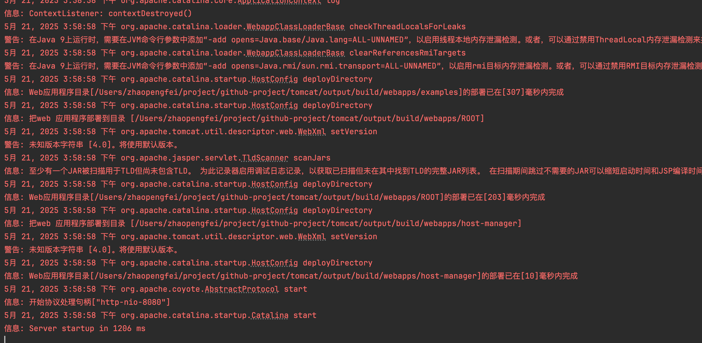

# Tomcat
## 1.Tomcat 源码环境搭建

- 直接用 tomcat 8.5.x 版本
- 源码下载地址：https://github.com/apache/tomcat
- 其他版本各种错误，请自行解决
- 启动成功如下图：

- 访问地址：http://localhost:8080/

- 参考：
```
https://www.cnblogs.com/kukuxjx/p/17701288.html
https://github.com/yeepn/tomcat-for-idea?tab=readme-ov-file
```


## 2.源码分析

- Bootstrap主入口
[Bootstrap.java](java%2Forg%2Fapache%2Fcatalina%2Fstartup%2FBootstrap.java)


- 参考：
```
https://pdai.tech/md/framework/tomcat/tomcat-overview.html
```